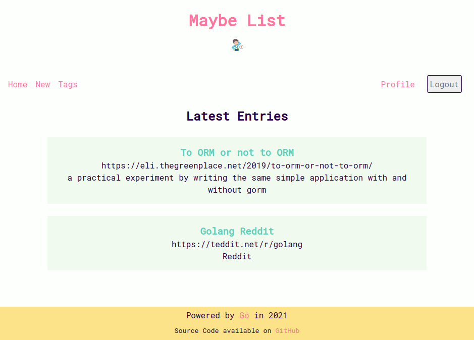
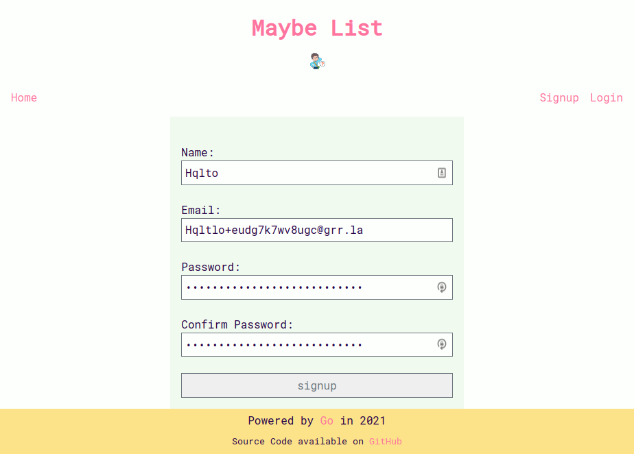
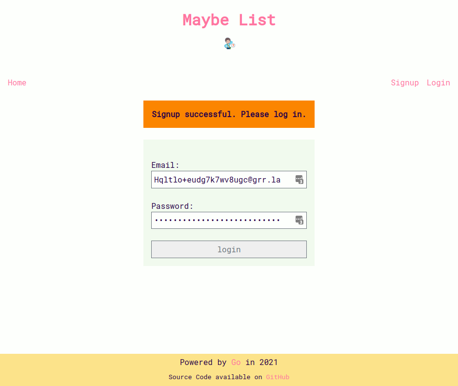
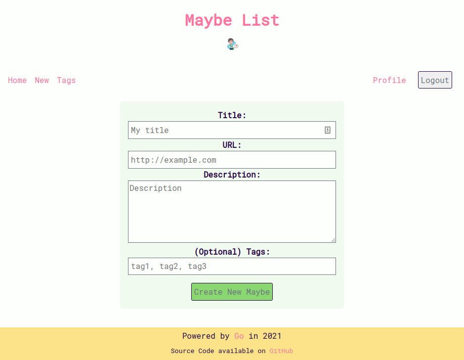
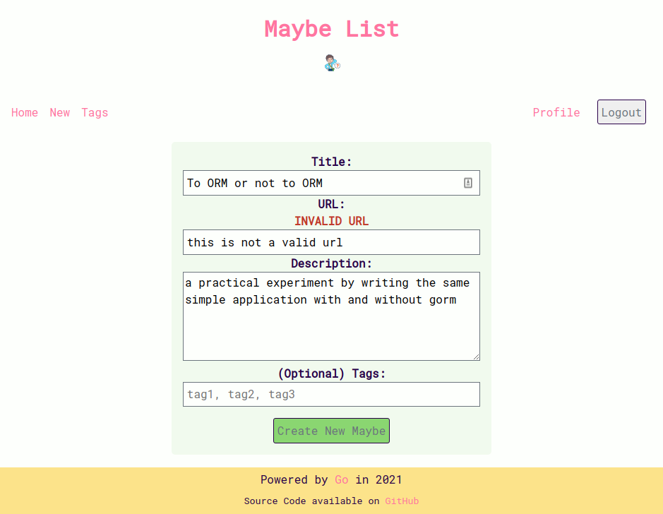
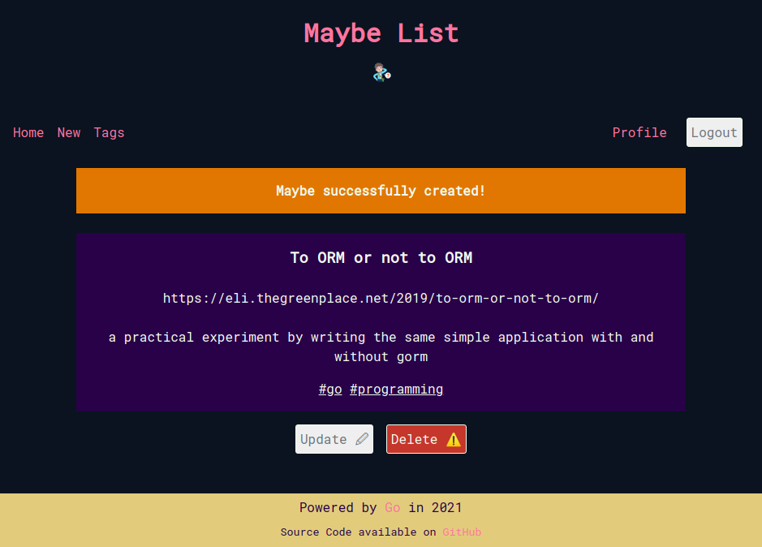

<!-- PROJECT SHIELDS -->

[![Contributors][contributors-shield]][contributors-url]
[![Issues][issues-shield]][issues-url]
[![Apache 2.0 License][license-shield]][license-url]

<!-- PROJECT LOGO -->
<br />
<p align="center">
  <a href="https://github.com/sophiabrandt/go-maybe-list">
    
  </a>

  <h3 align="center">go-maybe-list</h3>

  <p align="center">
    Go full-stack web app from scratch
    <br />
    <a href="https://github.com/sophiabrandt/go-maybe-list"><strong>Explore the docs »</strong></a>
    <br />
    <br />
    <a href="https://gomaybelist.repository.host/">View Demo</a>
    ·
    <a href="https://github.com/sophiabrandt/go-maybe-list/issues">Report Bug</a>
    ·
    <a href="https://github.com/sophiabrandt/go-maybe-list/issues">Request Feature</a>
  </p>
</p>

<!-- TABLE OF CONTENTS -->
<details open="open">
  <summary><h2 style="display: inline-block">Table of Contents</h2></summary>
  <ol>
    <li>
      <a href="#about-the-project">About The Project</a>
      <ul>
        <li><a href="#features">Features</a></li>
      </ul>
      <ul>
        <li><a href="#built-with">Built With</a></li>
      </ul>
      <ul>
        <li><a href="#screenshots">Screenshots</a></li>
      </ul>
    </li>
    <li>
      <a href="#getting-started">Getting Started</a>
      <ul>
        <li><a href="#prerequisites">Prerequisites</a></li>
        <li><a href="#installation">Installation</a></li>
      </ul>
    </li>
    <li><a href="#usage">Usage</a></li>
    <li><a href="#roadmap">Roadmap</a></li>
    <li><a href="#contributing">Contributing</a></li>
    <li><a href="#license">License</a></li>
    <li><a href="#contact">Contact</a></li>
    <li><a href="#acknowledgements">Acknowledgements</a></li>
  </ol>
</details>

<!-- ABOUT THE PROJECT -->

## About The Project

**go-maybe-list** is a full-stack web application written in Go. It's written from scratch, without any pre-build web framework like Gin or Echo.

You can save links and ideas as "maybes" for later. Each maybe can have none or one to many tags.   
You can either view all entries or only entries belonging to a tag.  
If you update a maybe, tags will be dynamically added, updated or deleted.

I've deployed a **[demo][demo]** (via GitOps/Gitlab CI) to a $5 [Upcloud VPS](https://upcloud.com/) ([How?](https://www.rockyourcode.com/traefik-2-docker-swarm-setup-with-docker-socket-proxy-and-more/)).

Use `testuser@testuser.com` with password `123456Ma$` or sign up with a new account.

### Features

- custom web service framework/handler to isolate dependencies and improve error handling
- middleware integration
- SQL database support using SQLite (easy to swap out to a different SQL database)
- _no_ ORM, use of Go's standard `database/sql` library and [`jmoiron/sqlx`](https://github.com/jmoiron/sqlx)
- user authentication and authorization with sessions
- profile view and change password
- form validation
- use of Docker, Docker Compose, Makefiles
- vendoring dependencies with Modules, requires Go 1.12 or higher
- Admin CLI with boilerplate templates to reduce repetitive copy/pasting.
- responsive HTML and CSS _without_ media queries
- dark and light theme (via [`prefers-color-scheme`](https://developer.mozilla.org/en-US/docs/Web/CSS/@media/prefers-color-scheme)) 

### Built With

- [Go](https://golang.org/)
- [SQLite](https://www.sqlite.org)

### Screenshots

* Home Page


* Signup/Register


* Login (with flash message from previous successful signup)


* Create a new entry


* Validation errors


* Dark mode


<!-- GETTING STARTED -->

## Getting Started

To get a local copy up and running follow these steps.

### Prerequisites

You'll need Go (Go 1.12 or later) and SQLite.

### Installation

1. Clone the repository.

   ```sh
   git clone https://github.com/sophiabrandt/go-maybe-list.git
   ```

2. Run database migrations.

   ```sh
   go run ./cmd/admin -action="migrate"
   go run ./cmd/admin -action="seed"
   ```

3. Run web server. Default port is 4000, you can change it with a command line flag.
   ```sh
   go run ./cmd/web
   # go run ./cmd/web -addr="0.0.0.0:8000"
   ```

Alternatively, use the provided [`Makefile`](Makefile) for convenience.

<!-- USAGE EXAMPLES -->

## Usage

Register for a new account, sign in, and add new "maybes".

<!-- ROADMAP -->

## Roadmap

See the [open issues](https://github.com/sophiabrandt/go-maybe-list/issues) for a list of proposed features (and known issues).

<!-- CONTRIBUTING -->

## Contributing

Contributions are what make the open source community such an amazing place to be learn, inspire, and create. Any contributions you make are **greatly appreciated**.

1. Fork the Project
2. Create your Feature Branch (`git checkout -b feature/AmazingFeature`)
3. Commit your Changes (`git commit -m 'Add some AmazingFeature'`)
4. Push to the Branch (`git push origin feature/AmazingFeature`)
5. Open a Pull Request

<!-- LICENSE -->

## License

Apache 2.0 License, see [`LICENSE`](LICENSE).

<!-- CONTACT -->

## Contact

Sophia Brandt - [@hisophiabrandt](https://twitter.com/hisophiabrandt)

Project Link: [https://github.com/sophiabrandt/go-maybe-list](https://github.com/sophiabrandt/go-maybe-list)

<!-- ACKNOWLEDGEMENTS -->

## Acknowledgments

- [Let's Go](https://lets-go.alexedwards.net/)
- [https://github.com/dlsniper/gopherconuk](https://github.com/dlsniper/gopherconuk)
- [How I write HTTP services after eight years.](https://pace.dev/blog/2018/05/09/how-I-write-http-services-after-eight-years.html)
- [http.Handler and Error Handling in Go](https://blog.questionable.services/article/http-handler-error-handling-revisited/)
- [Develop A Production Ready REST API in Go](https://tutorialedge.net/courses/go-rest-api-course/)
- [https://github.com/ardanlabs/service](https://github.com/ardanlabs/service)
- [Graceful shutdown of Golang servers using Context and OS signals](https://archive.is/Mf0dJ)
- [Learning Cloud Native Go](https://learning-cloud-native-go.github.io/)
- [Every Layout](https://every-layout.dev)

<!-- MARKDOWN LINKS & IMAGES -->
<!-- https://www.markdownguide.org/basic-syntax/#reference-style-links -->

[contributors-shield]: https://img.shields.io/github/contributors/sophiabrandt/go-maybe-list.svg?style=for-the-badge
[contributors-url]: https://github.com/sophiabrandt/go-maybe-list/graphs/contributors
[issues-shield]: https://img.shields.io/github/issues/sophiabrandt/go-maybe-list.svg?style=for-the-badge
[issues-url]: https://github.com/sophiabrandt/go-maybe-list/issues
[license-shield]: https://img.shields.io/github/license/sophiabrandt/go-maybe-list.svg?style=for-the-badge
[license-url]: https://github.com/sophiabrandt/go-maybe-list/blob/master/LICENSE
[demo]: https://gomaybelist.repository.host/
